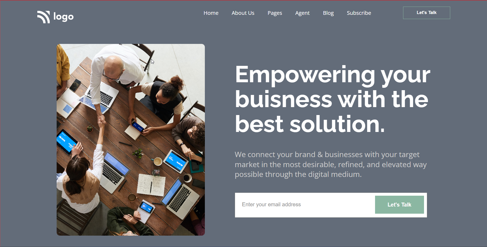

# Assignment-12 HTML And CSS
By **saurabh**

# [GO LIVE](https://busness-ideas-ineuron-ai.netlify.app/)

---

 
 ***
 ## Technologies used

> HTML

> CSS  
---

***

## **Skill Gained in the project**
   - First and fourmost Thing **flexbox** in depth.
   - I also learned background Shadow and beside navbar.
   - I learned @mediaQuerry.

___

# Time taken to finish this project

-   Approximately **3:5 hour** taken to complete this one.
-   Nearby **4 hour** to make it responsive.
